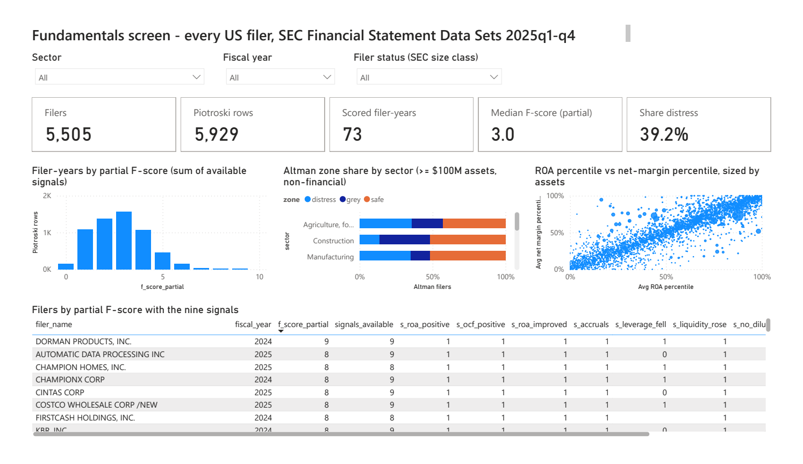
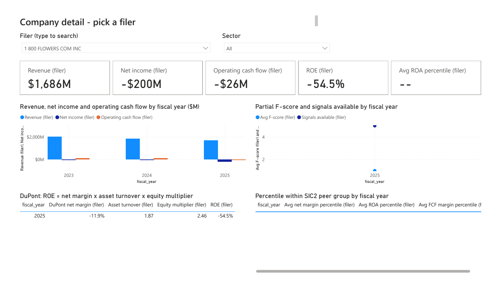
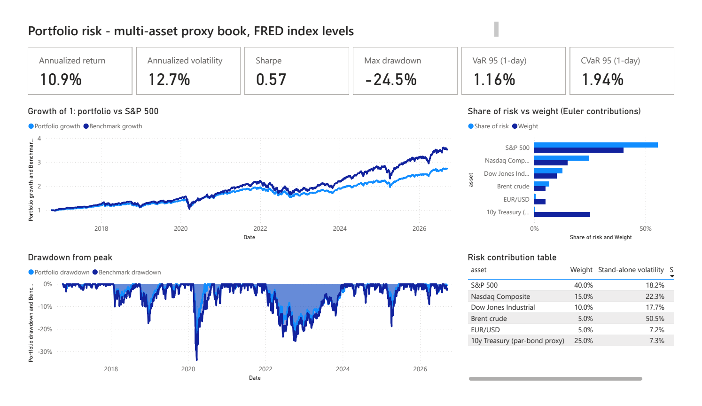
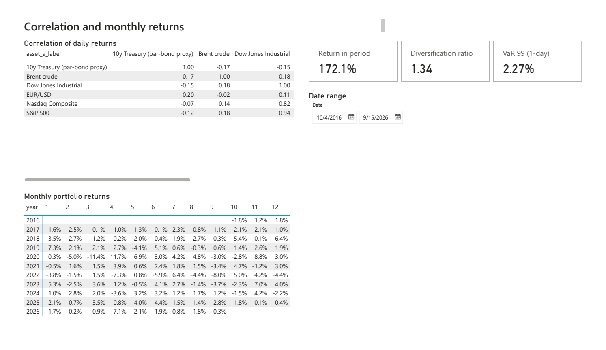

# finance-dashboards-powerbi

Power BI dashboards over the data produced by my other three repositories —
[market-data-warehouse](https://github.com/davrod-dev/market-data-warehouse),
[equity-fundamentals-sql](https://github.com/davrod-dev/equity-fundamentals-sql) and
[portfolio-risk-report](https://github.com/davrod-dev/portfolio-risk-report).
The SQL and Python live there. This repository is the reporting layer: a
reproducible dataset export, a star-schema semantic model, and a four-page
report — **all generated as code** (TMDL + PBIR, Power BI's project format),
opened and refreshed in Power BI Desktop, and exported as `.pbix` and PDF.

[](https://github.com/davrod-dev/finance-dashboards-powerbi/actions/workflows/ci.yml)

| | |
|---|---|
| [](docs/images/1-fundamentals-screen.png) | [](docs/images/2-company-detail.png) |
| [](docs/images/3-portfolio-risk.png) | [](docs/images/4-correlation-calendar.png) |

Open [`reports/finance-dashboards.pbix`](reports/finance-dashboards.pbix)
in Power BI Desktop for the interactive version, or
[`reports/finance-dashboards.pdf`](reports/finance-dashboards.pdf) for a
static copy.

## The pages

| page | what it shows | notable |
|---|---|---|
| **Fundamentals screen** | every US filer in the SEC Financial Statement Data Sets (2025q1–q4): 5,505 filers; slicers for sector, fiscal year, SEC size class; F-score distribution; Altman zone share by sector; ROA-vs-margin percentile scatter; a sortable table of filers with all nine Piotroski signals | only 73 filer-years have a full nine-signal F-score, so the page uses a *partial* score (sum of available signals) and says so |
| **Company detail** | pick one filer: revenue, net income and cash flow by year in $M; partial F-score by year; DuPont decomposition; percentile within SIC peers | every measure on the page returns blank unless exactly one filer is in context — the page cannot accidentally show an average of six thousand companies |
| **Portfolio risk** | the multi-asset proxy book from portfolio-risk-report: annualised return, volatility, Sharpe, max drawdown, VaR and CVaR; growth of 1 vs S&P 500; drawdown from peak; Euler risk contribution vs weight | matches the HTML report to the digit (10.9 % return, 12.7 % vol, 0.57 Sharpe, −24.5 % max drawdown) |
| **Correlation & calendar** | correlation matrix of daily returns; monthly return grid by year; date-range slicer with return-in-period | totals are switched off on both matrices: a sum of correlations is not a number |

## How it is built

```
sibling repos (DuckDB files, cached FRED series)
        │  scripts/export_dataset.py     17 tidy tables -> data/*.parquet (CSV fallback, ignored)
        ▼
data/*.parquet
        │  scripts/build_pbip.py         reads the Parquet schemas and writes the whole project:
        ▼
powerbi/finance-dashboards.pbip
   ├── finance-dashboards.SemanticModel/   TMDL: 16 tables typed from Parquet, dim_date and
   │                                       dim_fiscal_year built in M, 12 relationships,
   │                                       54 measures with descriptions and display folders
   └── finance-dashboards.Report/          PBIR: 4 pages, 28 visuals, as JSON
        │  Power BI Desktop: open, Refresh, Save; File > Export > PDF; Save as .pbix
        ▼
reports/finance-dashboards.pbix, reports/finance-dashboards.pdf, docs/images/*.png
```

The point of generating the project rather than clicking it together: the
model and every visual are text, diffable and testable. CI regenerates the
project into a temp folder and checks that every column and measure a
visual references exists in the model, that every relationship joins real
columns, that no table or card projection carries the flag that crashes
Desktop's table renderer, and that every measure has a description, a
display folder and a format string. The committed data is validated the
same way: grain, keys, foreign keys, score ranges — 36 tests in all.

Rebuild after the upstream repos change:

```bash
python scripts/export_dataset.py     # needs the sibling repos next to this one
python scripts/build_pbip.py         # rewrites powerbi/
pytest                               # 36 tests
```

Then open `powerbi/finance-dashboards.pbip` in Power BI Desktop and
**Refresh**. The one machine-specific value is the `DataFolder` parameter
(absolute path of `data/`), under Transform data > Manage parameters.

## Dataset

`scripts/export_dataset.py` reads the DuckDB databases and cached FRED
series from the sibling repos and writes each table as Parquet (primary)
and CSV (fallback) into `data/`. Power BI Desktop reads both natively.

| table | rows | grain | from |
|---|---:|---|---|
| `fundamentals_annual` | 16,340 | one row per filer per fiscal year end, 2020 to 2025, with a `sector` label from SIC major group (three filers changed year end, so key on `fiscal_year_end`, not `fiscal_year`) | equity-fundamentals-sql `core.annual` |
| `dim_company` | 5,505 | one row per filer: name, SIC, sector, years reported | derived |
| `piotroski_f_score` | 5,929 | filer x year, the nine signals, `f_score` (only when all nine could be evaluated: 73 filer-years) and `f_score_partial` with `signals_available` for the rest | query 05 |
| `altman_z_double_prime` | 2,450 | latest year per non-financial filer with >= $100M assets, Z'' and zone | query 06 |
| `sector_percentiles` | 3,023 | filer x year, net margin / ROA / FCF margin percentile within SIC2 peers | query 03 |
| `dupont` | 2,156 | filer x year, ROE decomposed into margin x turnover x leverage | query 07 |
| `mdw_fundamental_metrics` | 135 | eight large filers x year, 29 metrics from the warehouse mart | market-data-warehouse |
| `mdw_dim_company` | 8 | the warehouse company dimension | market-data-warehouse |
| `portfolio_daily` | 2,436 | trading day: portfolio and benchmark return, growth index, drawdown | portfolio-risk-report |
| `asset_returns_long` | 14,616 | day x asset daily return | portfolio-risk-report |
| `asset_levels_long` | 14,622 | day x asset price level | portfolio-risk-report |
| `risk_contributions` | 6 | asset: weight, volatility, marginal and component risk, share | portfolio-risk-report |
| `monthly_returns` | 11 | year x month return grid | portfolio-risk-report |
| `monthly_returns_long` | 120 | one row per year and month, for a matrix visual | portfolio-risk-report |
| `summary_metrics` | 2 | portfolio and benchmark: return, vol, Sharpe, Sortino, max drawdown, Calmar | portfolio-risk-report |
| `tail_risk` | 2 | VaR and CVaR at 95 and 99 | portfolio-risk-report |
| `correlation_long` | 36 | asset pair correlation, with readable labels | portfolio-risk-report |

## Model

Star schema, one fact per grain. `dim_company` (keyed on `cik`) and
`dim_fiscal_year` join every fundamentals fact so one slicer filters them
all; `dim_date` (a contiguous calendar built in M, marked as the date
table) joins the daily facts. Relationships are single direction, dimension
to fact. All 54 measures live in `_Measures`, grouped in display folders,
each with a description and a format string.

```
dim_company (cik)          1 --- * fundamentals_annual, piotroski_f_score,
dim_fiscal_year (year)     1 --- *   altman_z_double_prime, sector_percentiles, dupont
dim_date (Date)            1 --- * portfolio_daily, asset_returns_long
```

A few of the measures:

```dax
Share distress = DIVIDE(CALCULATE(COUNTROWS(altman_z_double_prime), altman_z_double_prime[zone] = "distress"),
                        COUNTROWS(altman_z_double_prime))
Return in period = PRODUCTX(portfolio_daily, 1 + portfolio_daily[portfolio_return]) - 1
Portfolio drawdown = MIN(portfolio_daily[portfolio_drawdown])        -- exact per date; its minimum over a period is the max drawdown
Filer selected = HASONEVALUE(dim_company[cik])
Revenue (filer) = VAR y = MAX(fundamentals_annual[fiscal_year])
                  RETURN IF([Filer selected], CALCULATE([Revenue], fundamentals_annual[fiscal_year] = y))
```

## Design notes: what Power BI Desktop corrected

The generator was written from Microsoft's published sample project and
JSON schemas, then opened in Desktop; each of these was a real failure on
screen, fixed in the generator and locked in by a test.

1. **`"active": true` on table projections crashes the table renderer.**
   Copied from a bar-chart template, the flag made every table that mixed
   columns and measures throw a JavaScript `TypeError` and render one
   column. Desktop-authored tables never carry it. Tested.
2. **Display units "None" is `1D`; `0D` is Auto.** Until then, cards printed
   `$0bnM` — auto units scaled to billions and the format string scaled
   again.
3. **A format string's `,,` scaling is ignored when a literal follows it.**
   Money measures divide by 1e6 in DAX and format as `\$#,##0\M`.
4. **A company page must refuse to aggregate 5,505 filers.** With no filer
   chosen, the first version showed an "ROE" of −54.5 % that was the mean
   of 2,156 rows. Measures now return blank unless one filer is in context
   and use the latest fiscal year in context, which still works per year
   in the by-year charts.
5. **Subtotals are noise for matrices of ratios.** Off on both.
6. **Slicers need about 60 px of height** to show their dropdown.

## Why Power BI, and how it transfers

Regional finance postings name Power BI more than any other BI tool; some
name Oracle BI, QlikView or Spotfire instead. The parts that transfer are
the ones this repository spends its effort on: a validated star schema, a
dimension that lets one slicer filter every fact, explicit measures with
documented semantics, and pages that refuse to show a misleading
aggregate. The visuals are the last ten percent in any tool.

## Data notes

- SEC Financial Statement Data Sets are what filers reported, not a cleaned
  vendor feed. About 38 % of filer-years have no revenue tag (banks, REITs,
  holding companies and shells report differently). The scores already
  handle this: an F-score is only reported when all nine signals can be
  evaluated, and Altman excludes financials and sub-$100M filers.
- "Unclassified" sector means the SEC record has no SIC code.
- The portfolio is a multi-asset proxy built from public FRED index levels.
  It demonstrates the analytics; it is not an investable allocation.

## Built with Claude Code

Claude Code wrote the export script, the generator, the tests and this
README; installed Power BI Desktop; opened the generated project; and
checked every page by taking screenshots and driving Desktop by mouse and
keyboard, since that is the only way it can see a GUI. The six design notes
above are what that loop found. The human chose the pages, the data, the
rule that this repository shares nothing with any other project, and what
to ship. [`CLAUDE.md`](CLAUDE.md) has the conventions and the process.

## License

MIT. Source data is SEC (public domain) and FRED (its own terms); this
repository stores derived tables only.

---

David Rodriguez · [github.com/davrod-dev](https://github.com/davrod-dev)
